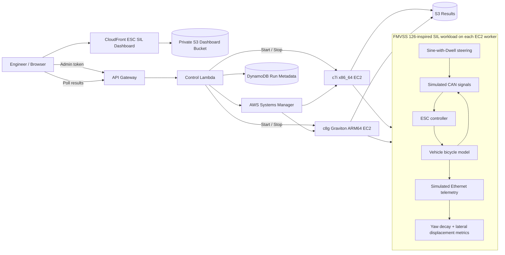

# AWS Graviton FMVSS 126 ESC SIL Benchmark

[](https://codespaces.new/ashtonhashemi/aws-graviton-automotive-benchmar?quickstart=1)

A portfolio-scale automotive SIL project that runs the same **FMVSS No. 126-inspired Electronic Stability Control (ESC) Sine-with-Dwell simulation** on an x86_64 EC2 worker and an AWS Graviton ARM64 worker.

> This is an educational/engineering simulation inspired by the FMVSS No. 126 maneuver and performance metrics. It is **not** an FMVSS compliance or certification test.

## What is simulated

- 80 km/h nominal entry speed.
- 0.7 Hz Sine-with-Dwell steering maneuver with a 500 ms dwell at the second peak.
- Simplified Slowly Increasing Steer characterization to estimate the steering-wheel angle corresponding to 0.3 g.
- Simulated CAN signals for steering angle, vehicle speed, yaw rate, and lateral acceleration.
- ESC controller that estimates desired yaw rate and commands a corrective yaw moment.
- Simplified nonlinear bicycle vehicle plant with front/rear lateral tire-force saturation.
- Simulated Ethernet/cloud telemetry packets at 100 ms intervals.
- ESC ON/OFF comparison.
- FMVSS-style yaw-decay checks at 1.0 s and 1.75 s after completion of steer.
- FMVSS-style lateral-displacement check at 1.07 s after Beginning of Steer.

The model intentionally allows an **ESC OFF** run to become unstable enough to fail the simulated yaw-decay checks while the **ESC ON** controller stabilizes the same maneuver. CI regression tests enforce this behavior.

## AWS experiment

The identical deterministic SIL workload runs on:

- **x86_64 EC2:** `c7i.large`
- **ARM64 / AWS Graviton:** `c8g.large`

The dashboard reports both vehicle-level results and compute performance:

- yaw-rate ratio at 1.0 s
- yaw-rate ratio at 1.75 s
- lateral displacement at 1.07 s
- simulated ESC pass/fail
- wall time
- CPU time
- simulation steps/second
- memory usage
- ARM/x86 throughput ratio
- functional-result equality across architectures

## Architecture



Detailed Mermaid source: [`docs/architecture.mmd`](docs/architecture.mmd).

## Browser VS Code / Codespaces

Open the Codespaces badge above. The dev container includes Python, AWS CLI, SAM CLI, GitHub CLI, `jq`, `make`, AWS Toolkit for VS Code, Python tooling, and YAML support.

Authenticate to AWS:

```bash
aws configure
aws sts get-caller-identity
```

or with IAM Identity Center:

```bash
aws configure sso
aws sso login
aws sts get-caller-identity
```

Deploy or update the complete lab:

```bash
bash scripts/codespace-deploy.sh
```

The helper selects the default VPC/public subnet in `us-west-2`, generates/saves the dashboard admin token when needed, deploys the SAM/CloudFormation stack, uploads the latest ESC SIL workload and dashboard, and prints the CloudFront dashboard URL.

## Running the ESC experiment

1. Open the CloudFront dashboard.
2. Enter the saved admin token and click **Use configuration**.
3. Click **Start Both** and wait for x86 and Graviton to report `running`.
4. Select **ESC ON**, `baseline`, 100000 target simulation steps, and 3 iterations.
5. Run the ESC simulation and compare vehicle-level and compute results.
6. Repeat with **ESC OFF** to demonstrate the stability-control effect.
7. Repeat ESC ON with `optimized` to compare software tuning on both architectures.
8. Leave **Auto-stop workers** enabled or click **Stop Both** when finished.

Retrieve the Codespaces token with:

```bash
cat ~/.aws-graviton-admin-token
```

Update only dashboard files after frontend changes:

```bash
bash scripts/update-dashboard.sh
```

Stop compute:

```bash
bash scripts/stop-workers.sh
```

Delete the entire lab:

```bash
bash scripts/destroy.sh
```

## Repository layout

```text
benchmark/          FMVSS 126-inspired ESC SIL simulation
infra/              AWS SAM / CloudFormation infrastructure
src/control/        Lambda dashboard/control-plane API
dashboard/          ESC SIL + compute comparison dashboard
docs/               Architecture and tuning notes
tests/              Vehicle-level regression checks
scripts/             Deploy, update, stop, destroy, Codespaces helpers
.devcontainer/       Browser VS Code environment
.github/workflows/  Functional smoke tests + SAM validation
```

## Functional regression

```bash
make test
```

The regression requires:

- ESC ON stability at 1.0 s: pass
- ESC ON stability at 1.75 s: pass
- ESC ON responsiveness: pass
- ESC OFF overall simulated result: fail
- baseline and optimized modes: identical vehicle-level output

## FMVSS No. 126 basis

The project uses selected concepts from the NHTSA FMVSS No. 126 Sine-with-Dwell procedure: the 0.7 Hz input, 500 ms dwell, approximately 80 km/h entry condition, yaw-rate decay criteria, and lateral-displacement responsiveness metric. Real FMVSS testing includes detailed vehicle preparation, instrumentation, filtering, Slowly Increasing Steer runs, left/right test series, steering-amplitude progression, equipment requirements, and other regulatory provisions that this simplified SIL model does not reproduce.

## Security and cost scope

This is a lab/portfolio control plane, not a production fleet manager. EC2 workers have no inbound rules and are controlled through Systems Manager. The API uses a lab-only shared token stored as a `NoEcho` CloudFormation parameter. Workers can auto-stop after a run to reduce compute cost.

## Portfolio statement

> Developed an AWS-hosted ESC Software-in-the-Loop benchmark based on the FMVSS No. 126 Sine-with-Dwell maneuver, modeling CAN sensor traffic, closed-loop yaw control, vehicle dynamics, Ethernet telemetry, regulatory-style stability metrics, and identical execution on x86_64 and AWS Graviton ARM64 compute.
