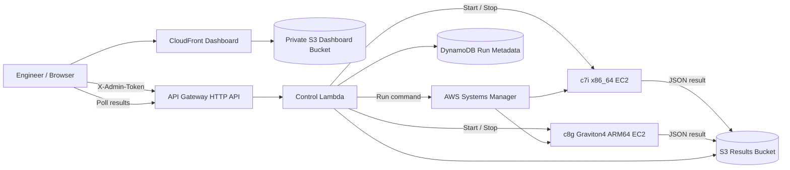

# AWS Graviton Automotive Benchmark

A portfolio-scale engineering lab that compares an **x86_64 EC2 worker** with an **AWS Graviton ARM64 worker** using the same synthetic automotive CAN/DTC processing workload.

The goal is not merely to launch a Graviton instance. The repository demonstrates infrastructure-as-code, architecture-aware deployment, remote test orchestration, repeatable benchmarking, result capture, performance tuning, and cost-conscious lifecycle control.

## What it does

- Provisions one x86_64 EC2 worker and one ARM64/Graviton worker with AWS SAM / CloudFormation.
- Uses **AWS Systems Manager**, not SSH, to run the workload; the worker security group has no inbound rules.
- Provides a CloudFront-hosted dashboard to **start**, **stop**, and benchmark either architecture.
- Runs the same deterministic CAN/DTC processing workload on both machines.
- Stores run metadata in DynamoDB and benchmark JSON in S3.
- Compares wall time, CPU time, records/second, memory, and ARM-to-x86 throughput ratio.
- Supports `baseline` and `optimized` code paths for a tuning case study.
- Includes cleanup scripts so expensive compute does not need to stay running.

## Architecture



The Mermaid source is also in [`docs/architecture.mmd`](docs/architecture.mmd).

## Repository layout

```text
benchmark/          Deterministic CAN/DTC CPU workload
infra/              AWS SAM / CloudFormation infrastructure
src/control/        Lambda dashboard/control-plane API
dashboard/          Static benchmark dashboard
docs/               Architecture and tuning notes
scripts/             Deploy, stop, and destroy helpers
.github/workflows/  Smoke test + SAM validation
```

## Benchmark workload

Each synthetic CAN frame contains representative vehicle signals such as speed, temperature, voltage, and a fault flag. The processor decodes the signals, evaluates fault conditions, computes aggregate values, and produces a deterministic checksum.

The checksum and summary values make it possible to verify that performance improvements did not alter the expected workload behavior.

### Local smoke test

```bash
make test
```

## AWS deployment

Prerequisites: AWS CLI v2, AWS SAM CLI, Python 3, AWS credentials configured locally, a VPC, and a subnet with outbound internet connectivity.

```bash
export AWS_REGION=us-west-2
export VPC_ID=vpc-xxxxxxxx
export SUBNET_ID=subnet-xxxxxxxx
export ADMIN_TOKEN="use-a-long-random-secret-here"
./scripts/deploy.sh
```

The script deploys the stack, uploads `benchmark.py` to the private results bucket, uploads the dashboard to its private S3 origin, creates the dashboard configuration, and prints the CloudFront URL.

**Cost control:** the workers bootstrap once and then shut themselves down. Benchmark runs also default to auto-stop after uploading results. You can stop both at any time from the dashboard or:

```bash
./scripts/stop-workers.sh
```

when they are not under test. Delete the entire lab with:

```bash
./scripts/destroy.sh
```

## Running a comparison

1. Open the CloudFront dashboard.
2. Enter the `ADMIN_TOKEN` used during deployment. It is held only in browser session storage.
3. Click **Start Both**.
4. Wait until both show `running` and SSM has had time to reconnect.
5. Select `baseline` or `optimized`, workload size, and iteration count.
6. Run the benchmark and wait for both JSON results.
7. Compare throughput and wall time.
8. Stop both workers.

## Tuning study

The first optimization is intentionally understandable rather than exotic: the optimized path removes temporary lists, retains integer values in the hot loop, reduces conversions, and minimizes repeated work. See [`docs/tuning.md`](docs/tuning.md) for the experiment matrix and next steps.

## Security scope

This is a **lab/portfolio control plane**, not a production fleet manager. The API uses a shared admin token supplied as a `NoEcho` CloudFormation parameter and never committed to the repository. EC2 workers accept no inbound connections and are controlled with SSM. For a production implementation, replace the shared token with Cognito/OIDC authorization and place private workers behind VPC endpoints/NAT as appropriate.

## Suggested portfolio result statement

> Designed an AWS Graviton benchmarking environment that deploys equivalent x86_64 and ARM64 compute workers, remotely orchestrates automotive CAN/DTC workloads through Systems Manager, captures performance results in S3/DynamoDB, and quantifies architecture and software-tuning tradeoffs through a web dashboard.

## Repository

This project is published at `ashtonhashemi/aws-graviton-automotive-benchmar` (repository name as currently created on GitHub).
