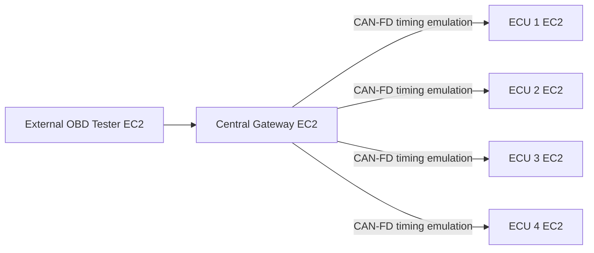
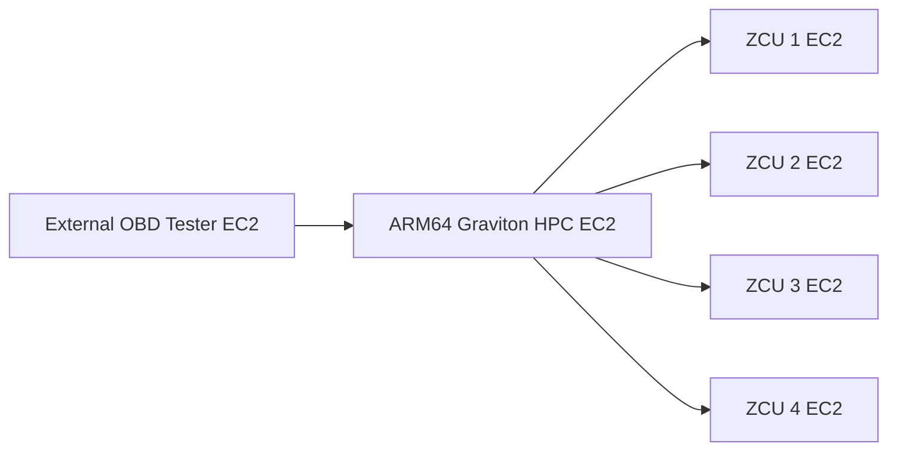

# AWS Automotive Systems Lab — Graviton HPC, ESC SIL, and OBDonUDS Architecture Benchmark

[](https://codespaces.new/ashtonhashemi/aws-graviton-automotive-benchmar?quickstart=1)

This repository contains two automotive systems-engineering experiments on AWS:

1. **Distributed ESC SIL** — an FMVSS 126-inspired closed-loop vehicle/ESC experiment using AWS Graviton and x86 EC2 nodes over real private-VPC UDP/IP.
2. **Measured OBDonUDS architecture benchmark** — an 11-node comparison of a legacy central-gateway/distributed-ECU architecture against a Graviton HPC with four independent zonal controllers.

These are engineering/research environments, not regulatory compliance or certification tools.

## Experiment 1 — Distributed ESC SIL

The Graviton node runs the vehicle dynamics and Sine-with-Dwell maneuver while an x86 node represents the ZCU/ESC controller. The 100 Hz control loop crosses real bidirectional UDP/IPv4 inside the AWS VPC.

Measured outputs include yaw-rate decay, lateral displacement, packet loss, network RTT, deadline misses, and controller compute time. The maneuver is inspired by FMVSS No. 126 but is intentionally simplified and is not a certification test.

## Experiment 2 — Measured OBDonUDS architecture benchmark

The benchmark asks a concrete architecture question: **how much tester-observed diagnostic response-time margin changes when four distributed diagnostic servers are moved behind a vehicle-centralized Graviton HPC and four ZCUs?**

### Legacy / distributed path



### Zonal / vehicle-centralized path



The zonal benchmark supports two HPC behaviors:

- **Transparent routing:** the tester addresses a ZCU and the HPC forwards the DoIP diagnostic transaction without owning the diagnostic service.
- **Application proxy:** the tester addresses an HPC proxy endpoint; the HPC terminates/parses the request, creates a new internal diagnostic transaction to the selected ZCU, waits for the ZCU response, and constructs the tester-facing response.

### What is real vs emulated

**Real AWS execution**

- 11 independent EC2 nodes in one subnet / Availability Zone.
- ARM64 AWS Graviton HPC (`c8g.large` default).
- Fixed-performance x86 nodes (`c7i.large` default) for tester, legacy gateway, distributed ECUs, and ZCU simulation.
- Real Linux scheduling and process execution.
- Real private-VPC TCP/IP traffic.
- DoIP common-header framing, TCP routing activation, and DoIP diagnostic-message payload type `0x8001`.
- Raw UDS ReadDataByIdentifier timing stimulus (`22 F1 90` / `62 F1 90`).
- Tester-observed P2 timing measured with a single-host monotonic clock.

**Explicitly emulated / controlled**

- CAN-FD serialization/contention timing between the legacy gateway and distributed ECUs.
- ECU/ZCU diagnostic processing-time profiles.
- Optional HPC application-proxy workload.

AWS has no physical automotive CAN interface in this setup, so the CAN-FD path is intentionally identified as a timing emulator rather than physical CAN. The DoIP/UDS implementation is a timing research harness, not a complete ISO 13400 or SAE J1979-2 conformance implementation.

### Benchmark outputs

For each architecture the tester records:

- mean P2Tester
- P50 / P95 / P99 / maximum
- percentage exceeding the selected timing budget
- P99 pass/fail against the selected budget
- per-ECU / per-ZCU P2Tester statistics
- end-to-end sample traces

The dashboard also exposes legacy CAN-FD arbitration rate, data-phase rate, modeled bus load, ECU/ZCU processing profile, and controlled HPC proxy workload.

## AWS control plane

AWS SAM / CloudFormation provisions the compute fleet, IAM, private security group, API Gateway, Lambda control plane, S3 results/dashboard buckets, DynamoDB run metadata, and CloudFront dashboard. EC2 nodes are controlled through AWS Systems Manager instead of SSH and are intended to remain stopped when experiments are not running.

## Deploy from Codespaces

Authenticate first:

```bash
aws sts get-caller-identity
```

Then deploy/update:

```bash
export ADMIN_TOKEN="$(cat ~/.aws-graviton-admin-token 2>/dev/null || true)"
bash scripts/codespace-deploy.sh
```

The deploy helper builds the SAM application, updates the CloudFormation stack, uploads runtime assets, refreshes the CloudFront dashboard, and prints the EC2 private IPs for both experiments.

Stop every EC2 lab node:

```bash
bash scripts/stop-workers.sh
```

Delete the complete lab:

```bash
bash scripts/destroy.sh
```

## CI / regression

```bash
make test
```

CI compiles the Lambda/control code and DoIP benchmark programs, runs the ESC and four-ECU/four-ZCU integration tests, validates dashboard JavaScript, and runs SAM template validation/linting.

## Repository layout

```text
benchmark/                         ESC reference workload
diagnostic_timing/                P2 timing model + measured DoIP benchmark
diagnostic_timing/aws_measured/   DoIP codec, ECU/ZCU server, gateway/HPC router, tester
infra/                             AWS SAM / CloudFormation infrastructure
src/control/                       Lambda dashboard/control-plane API
dashboard/                         ESC + OBDonUDS architecture dashboard
tests/                             Regression and network integration tests
scripts/                           Deploy, stop, destroy, and Codespaces helpers
```

## Scope statement

The cloud environment is designed for repeatable architecture exploration and shift-left integration testing. It does not reproduce an automotive SoC, physical CAN/CAN-FD transceiver behavior, electrical-layer effects, or complete regulatory protocol conformance. Those require later HIL/vehicle validation.
